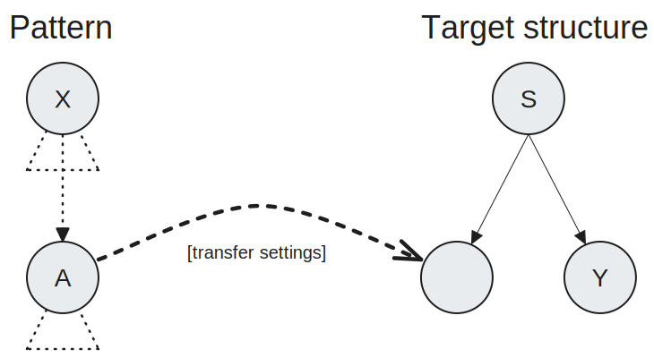
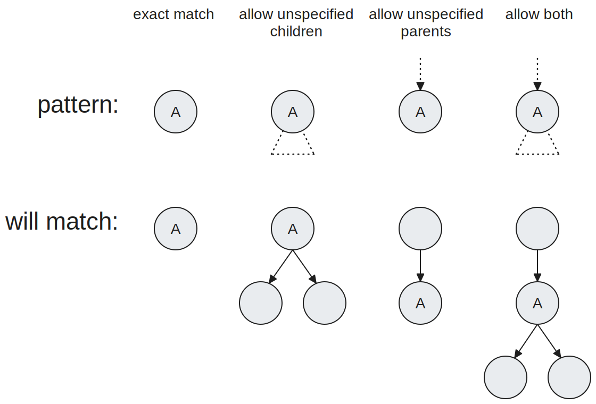
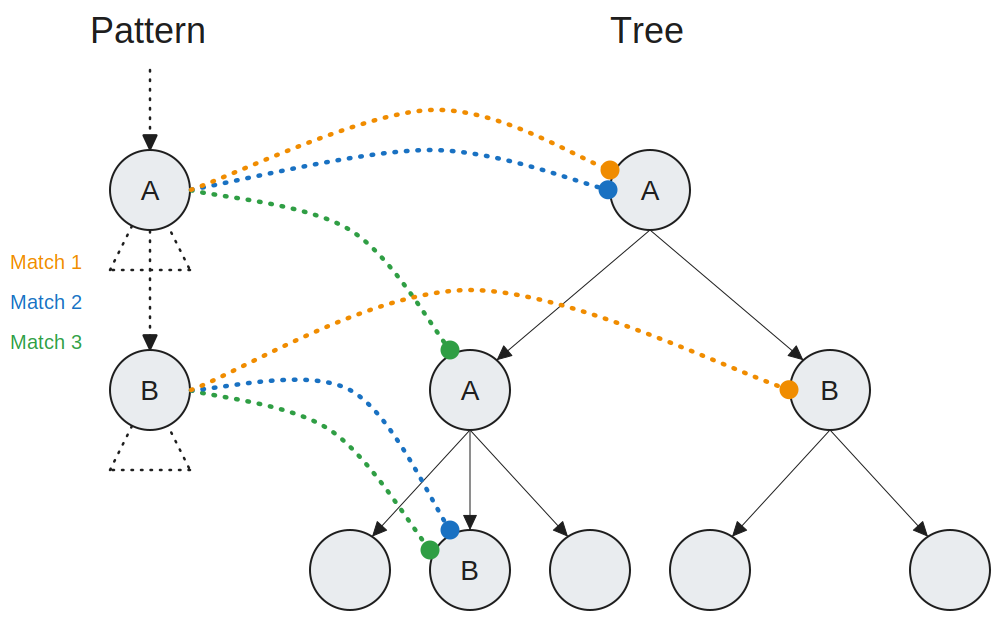
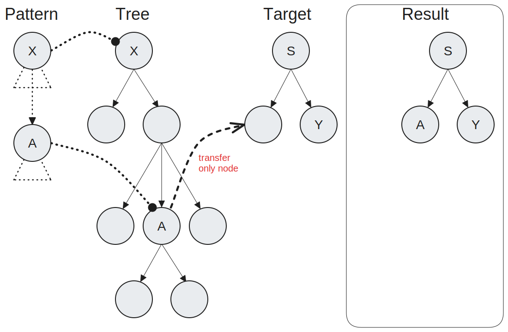
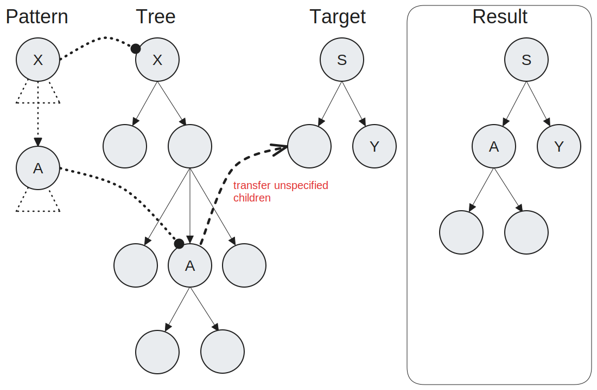
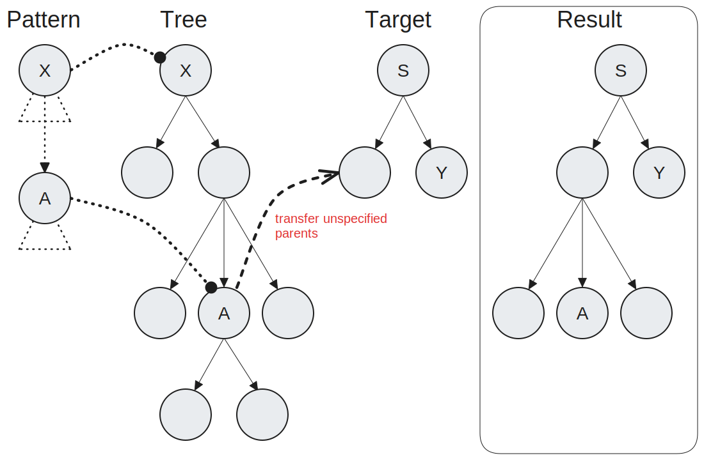
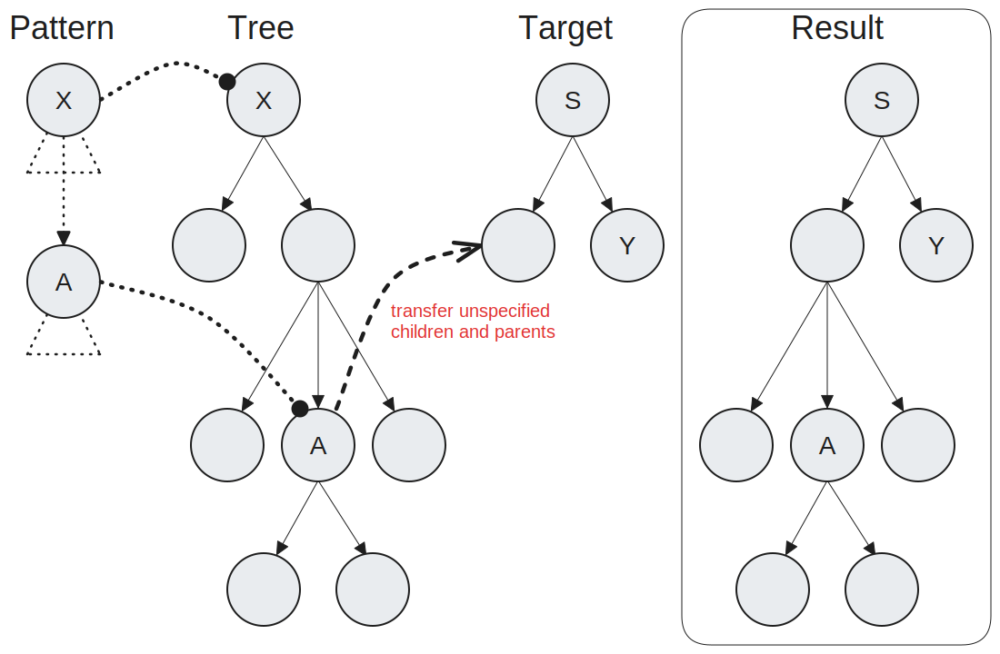
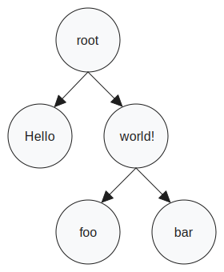
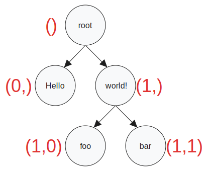

# What this is
This project can be used to restructure trees by defining **restructuring rules**.
For *text simplification* this can be applied by setting up rules to, for example, delete or displace structures in syntactic trees.


# Quickstart

## Setup
Make sure you have an adequate version of [Python](https://www.python.org/) installed (this project was built on *3.10.0*) and install [NLTK](https://www.nltk.org/install.html) (built with *3.7*). If you are using *pip*, you can run:

```bash
pip install --user -U nltk
```

Next, checkout the repository or download the relevant files;
- `TreeRestructureFunctions.py` and `RestructureRule.py` are required
- `restructure.py` provides a console interface. <br>Call `python restructure.py -h` for details.
- `visualize.py` lets you visualize the JSON files that are used and generated by the program. <br>Call `python visualize.py -h` for details.

You can also download and try out some of the *examples*.


## Usage
Use `restructure.py` for a command line interface (run `python restructure.py --help`) or import `RestructureRule` in a python script to access the class and its functions directly.

With `restructure.py`, pass the path to a JSON file containing a [Tree](#tree-json-format) and the path to another JSON file containing a [RestructureRule](#restructurerule-json-format) as arguments to receive a list of results.
# Match and transfer concept
The basis of this tree restructuring concept is to match some pattern tree and transfer the found nodes into some target tree.

<picture>
  <source media="(prefers-color-scheme: dark)" srcset="_assets/match-transfer-concept-dark.svg">
  
</picture>

For every node in the pattern tree you can specify
- whether to also *match child nodes* that aren't specified in the pattern tree,
- whether to also *match parent nodes* that aren't specified in the pattern tree<br>(which basically means that there may be any number of nodes between the one this is set for and its parent),
- *transfer coordinates* for the target tree
- whether to also *transfer unspecified child nodes*
- whether to also *transfer unspecified parent nodes*

## Matching

<picture>
  <source media="(prefers-color-scheme: dark)" srcset="_assets/node-setting-overview-dark.svg">
  
</picture>

Depending on the pattern and tree, a pattern may match in different ways.

<picture>
  <source media="(prefers-color-scheme: dark)" srcset="_assets/permutations-dark.svg">
  
</picture>

## Transfer

A result is built by transferring what is matched for each node to the target tree structure. How much of the match is also transferred depends on the transfer settings for the individual nodes.

<picture>
  <source media="(prefers-color-scheme: dark)" srcset="_assets/transfer-only-node-dark.svg">
  
</picture>

<picture>
  <source media="(prefers-color-scheme: dark)" srcset="_assets/transfer-unspecified-children-dark.svg">
  
</picture>

<picture>
  <source media="(prefers-color-scheme: dark)" srcset="_assets/transfer-unspecified-parents-dark.svg">
  
</picture>

<picture>
  <source media="(prefers-color-scheme: dark)" srcset="_assets/transfer-both-dark.svg">
  
</picture>

# Implementation

## RestructureRule
The `RestructureRule` class provides the intended way of interfacing with the implementation of the [match and transfer concept](#match-and-transfer-concept) through code.
Instances of the class hold a *pattern* tree, a *target* tree and a *rules* dictionary. When the `applyRule` method of an instance is called with some `Tree`;
- all possible matches for the `RestructureRule`'s *pattern* on the designated `Tree` are found,
- each match creates a separate result by transferring its matched nodes to the *target* tree structure,
- the resulting `Trees` are returned in a list.
Thus if a rule could be applied in different ways on the same tree, `applyRule` will return you all possible results.

### RestructureRule JSON format
The JSON object for a Restructure rule consists of the **`Pattern`**, **`Target`** and **`Rules`** keys.

The values for **`Pattern`** and **`Target`** are trees represented by [nested arrays](#tree-json-format).

**`Rules`** is used to specify the [matching and transfer settings](#match-and-transfer-concept) for the nodes in the pattern tree. For any node of the pattern tree that you want to specify settings for, put its [tree index](#tree-indexing) as a key into the **`Rules`** object. The index must look like a python tuple here. You can then specify whether to match unspecified children or parents and whether to transfer them with the `allowUnspecifiedChildren`, `allowUnspecifiedParents`, `transferUnspecifiedChildren`, `transferUnspecifiedParents` keys. The coordinates for target locations go into a list under the `targetIndex` key. Each element in that list is considered to be a set of coordinates so make sure that you put multiple digit coordinates in their own arrays in the list. If you only have one target location do e.g. `"targetIndex":[[0,3]]`. If you do `"targetIndex":[0,3]` it will think you mean the two locations, `(0,)` and `(3,)`.

```json
{
	"Pattern":["SomePatternTree"],
	"Target":["SomeTargetTree"],
	"Rules":{
		"()":{
			"targetIndex": [0,0],
			"allowUnspecifiedChildren": false,
			"transferUnspecifiedChildren": false,
			"allowUnspecifiedParents": false,
			"transferUnspecifiedParents": false
		},
		"(0,)":{
			"targetIndex": [
				[0,0],
				[0,1]
			],
			"allowUnspecifiedChildren": true,
			"transferUnspecifiedChildren": true,
			"allowUnspecifiedParents": true,
			"transferUnspecifiedParents": true
		},
	}
}
```

## Tree structure
Internally `RestructureRule` uses and operates on the `nltk.Tree` tree implementation (which I acknowledge as a design flaw).

### Tree JSON format
The **tree structure** used for input and output consists of nested lists where every node is of the format `[NodeLabel, [firstChildLabel], ..., [nthChildLabel]]`

```json
["root",
	["Hello"],
	["world!",
		["foo"],
		["bar"]
	]
]
```

<picture>
  <source media="(prefers-color-scheme: dark)" srcset="_assets/example-tree-dark.svg">
  
</picture>

### Tree indexing
The indexing system is the same one used by nltk.Tree.
To get the tree index for a node, take its parents tree index and append the list index of the node in its parents children list. In other words, to get the index of some node in relation to a root node you concatenate the list indexes you would use to get to the target node.

```python
l = ["root", ["Hello"], ["world!", ["foo"], ["bar"]]]
l[()].label()     #"root"
l[(1,)].label()   #"world!"
l[(1,0)].label()  #"foo"
```

<picture>
  <source media="(prefers-color-scheme: dark)" srcset="_assets/tree-indexing-dark.svg">
  
</picture>
